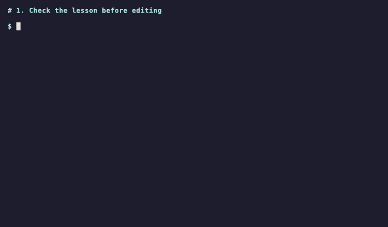

# Read, edit, and check a lesson

Every coding lesson follows the same loop:

```text
read the lesson  →  edit src/chapter_NN/lesson_NN.py  →  save
      ↑                                                  ↓
      └──────  read the result  ←  academy test CHAPTER LESSON
```

Run every command in the module folder, in the VS Code terminal. `academy` not found? [Install the software](install-uv-and-git.md) first. No module folder yet? Follow the module README's **Start here**.

Each lesson page names the file to edit and its command. The examples below use an invented exercise, `shot_label`, as Chapter 1, Lesson 2; your lessons name their own files and functions.

## Watch the workflow



This is a synthetic exercise, not a course answer. Notice the expected and actual
values in the failure, then the `TRY AGAIN` guidance. After saving the fix, the
same command produces `PASS`. The demo edits in a terminal; use VS Code as usual.

## 1. Read the lesson

Open it with `academy docs`, in VS Code, or on GitHub. Read the worked example before you edit anything.

Some lessons are reading only, such as a chapter's opening lesson. `academy test 1 1` then says there is nothing to check.

## 2. Run the checks first

```console
academy test 1 2
```

On a new lesson the checks fail, usually with `assert None == …`: the starter function has `pass` instead of a body, so it returns `None`. That means the lesson is ready to solve, not that something is broken. A setup problem looks different: `command not found` or `PROJECT ERROR`.

`academy test` stops at the first failing check, so you fix one thing at a time; the `PASSED` lines before it are the checks that already pass. Add `--all` to see every failing check.

## 3. Edit and save

The starter file gives you each function's signature, type hints, and docstring, with `pass` in place of the body:

```python
def shot_label(shot: str, version: int) -> str:
    """Return the label for one shot version, e.g. SH010 v002."""
    pass
```

Keep the signature and type hints. Replace `pass` with your code and save. There is nothing to reinstall.

## 4. Check again and read the result

```console
academy test 1 2
```

Read a failure from top to bottom:

```text
tests/chapter_01/test_lesson_02.py::test_shot_label[padded version] FAILED [ 33%]

=================================== FAILURES ===================================
_______________________ test_shot_label[padded version] ________________________
tests/chapter_01/test_lesson_02.py:13: in test_shot_label
    assert shot_label(shot, version) == expected
E   AssertionError: assert 'SH010 v2' == 'SH010 v002'
E
E     - SH010 v002
E     ?        --
E     + SH010 v2
!!!!!!!!!!!!!!!!!!!!!!!!!! stopping after 1 failures !!!!!!!!!!!!!!!!!!!!!!!!!!!
============================== 1 failed in 0.01s ===============================
```

1. **Which check:** `test_shot_label`, case `padded version`.
2. **Where:** line 13 of the test file.
3. **Yours versus expected:** in `assert A == B`, A is what your code returned.
4. **The difference:** `-` is the expected text, `+` is yours, and the `?` line marks with `-` the characters yours is missing (here `00`).

| Word | Means | Look at |
|---|---|---|
| `FAILED` | The check ran: your code returned the wrong value or raised an exception | the `E` lines: the two values, or the exception, file, and line |
| `ERROR` | The check could not run: its file failed to import or its setup failed | the last `E` line: exception, file, and line |

To see a value inside your function with `print`, see [when a check fails](fork-clone-setup.md#when-a-check-fails).

If your file has a syntax error, no check runs: **YOUR FILE DOES NOT LOAD** shows the line to fix.

The checks include cases the lesson never showed, so a hardcoded answer won't pass. Change your code, never the checks.

## 5. When it passes

```text
PASS
Checks passed.
```

PASS means the supplied checks passed, not every possible input. Commit and push:

```console
git add -A
git commit -m "Solve lesson 1.2"
git push
```

`git add -A` saves every file you changed.

## Other ways to check

| Command | Checks |
|---|---|
| `academy test 1 2` | one lesson, stopping at the first failing check |
| `academy test 1 2 --all` | one lesson, every failing check |
| `academy test 1` | the Core lessons of a chapter |
| `academy test 1 --gold` | the chapter's Core and Gold lessons, and each lesson's Gold section |
| `uv run pytest tests/chapter_01/test_lesson_02.py -v` | one test file, with every case listed |

Read the test files to see the exact inputs.

Lessons and the capstone are **Core** or **Gold**. Core completes a module; Gold lessons and Gold sections are optional and checked only with `--gold`. Each module's start page explains which lessons are Gold; Module 0 has none.

When the course changes, `academy health` says so, and `academy update` brings the changes in. It keeps the lesson code you already wrote.
