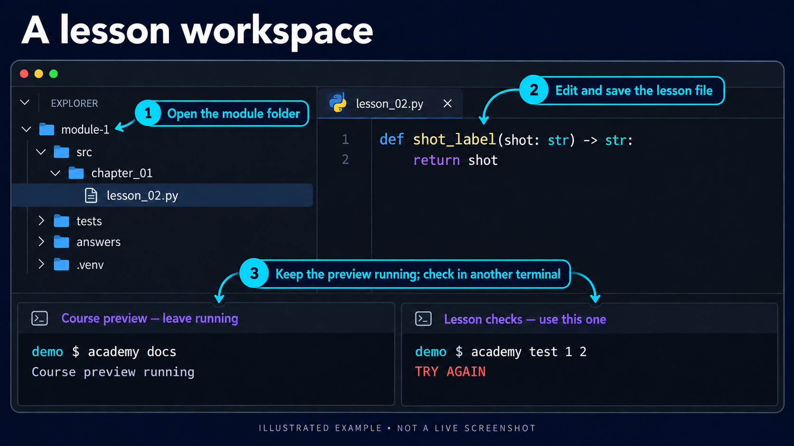

# Use VS Code for the course

You **edit** files in VS Code and **run** course commands in its built-in terminal. [Install the software](install-uv-and-git.md) installs it.

## Open the module folder

**File → Open Folder** and choose the module folder, for example `module-1`. Open the folder, not a single file.

Then **Terminal → New Terminal**. It starts in the open folder, which is where course commands must run. Check with:

```console
pwd
```

The last part of the path (on Windows, printed under `Path`) is the module folder. If not, move there with `cd`, for example `cd ~/module-1`.

## Two terminals



Illustrated example; the layout and exercise are simplified.

`academy docs` keeps running while you read the course in the browser. Leave that terminal open and click **+** in the terminal panel for a second one in the same folder. Use the second one for `academy test` and Git. **Ctrl+C** stops the preview.

## The editor's Python

VS Code finds the module's `.venv` after `uv sync --locked`. If every import has a red underline, open the Command Palette (**Ctrl+Shift+P**, or **Cmd+Shift+P** on macOS) → **Python: Select Interpreter** → choose `.venv`.

This only helps the editor highlight errors and complete names. `academy` always runs your checks with the right Python; you never activate an environment or use `pip`.

## Common problems

| You see                                                                            | Means                                    | Do                                                              |
| ---------------------------------------------------------------------------------- | ---------------------------------------- | --------------------------------------------------------------- |
| `command not found: uv` or `academy`; on Windows `The term 'uv' is not recognized` | The terminal started before the install  | Close it and open a new one; on Windows quit and reopen VS Code |
| `PROJECT ERROR` … `run academy inside your module folder`                          | The terminal is not in the module folder | `cd` into the module folder                                     |
| Red underlines on every import                                                     | The editor uses another Python           | **Python: Select Interpreter** → `.venv`                        |

Prefer another editor or your system's terminal? That works too; the commands are the same.
